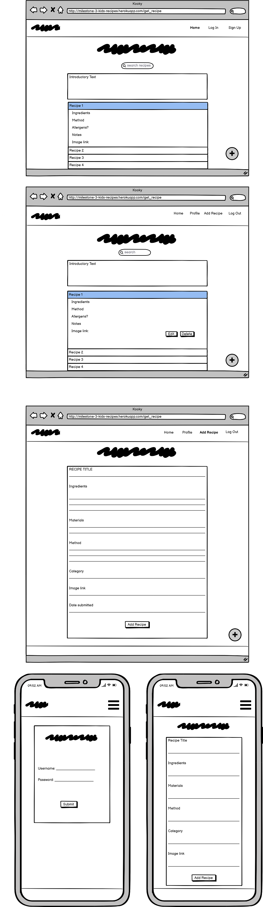
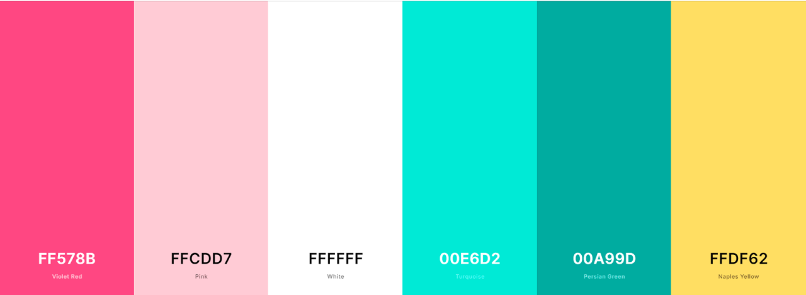

# **Milestone Project 3**  &nbsp;
# Table of Contents

1. [Purpose and Value](#purpose)
2. [Site Pages](#sitepgs)
	1. ['Home' page](#homepage)
	2. ['Log In'](#login)
	3. ['Join' page](#join)
	4. ['Profile' page](#profile)
	5. ['Add Recipe' page](#addrecipe)
	6. ['Edit Recipe' page](#editrecipe)
	7. ['Delete Recipe' button](#delrecipe)
	8. ['Log Out' menu item](#logout)
3. [Responsivity](#responsivity)
4. [UX (User Experience)](#userexperience)
	1. [Strategy Plane](#strategy)
	2. [Scope Plane](#scope)
	3. [Structure Plane](#structure)
    4. [Skeleton Plane](#skeleton)
	5. [Surface Plane](#surface)
5. [User Stories](#userstories)
	1. [First Time User](#firsttime)
	2. [Returning User/Frequent User](#returning)
	3. [Admin User](#admin)
6. [Testing](#testing)
    1. [User Testing](#usertesting)
	2. [Defensive User Testing](#defensive)
    3. [App Testing](#apptest)
	4. [Bug Fixes](#bugfixes)
7. [Validation](#validation)
8. [Design](#design)
	1. [Wireframes](#wireframes)
	2. [Colour Palette](#palette)
	3. [Images](#images)
	4. [Typography](#typography)
	5. [Current Features](#current)
	6. [Future Features](#future)
9. [Technologies](#technologies)
	1. [Languages](#languages)
	2. [Frameworks and Libraries](#frameworks)
10. [Deployment](#deployment)
11. [Credit and Acknowledgements](#credits)
	1. [Mentor](#mentor)
	2. [Code](#code)
    3. [Commits](#commits)
	4. [Images](#imagesa)
	5. [Text Content](#textcontent)  

# Kooky Kids Recipe App - Milestone Project 3

GitHub Repository: https://github.com/Saraholoughlin5/Milestone-Project-3

Heroku App: https://milestone-3-kids-recipes.herokuapp.com/

  

### **Purpose and Value**

The purpose of the Kooky Kids recipe app is to display easy to follow, cooking-free recipes, aimed at children, young teenagers and their parents or caretakers.  
The recipes are easy to find and view, and easy to follow.  
Users can read each recipe without logging in, however, if users do join the site (create a user profile) and log in they can then also create, edit and delete their own recipes. 
An Admin account can police the site and edit or delete any unsuitable additions.
Values include provision of user ability to document and edit their own recipes, visible to them on their own Profile page. The site is visually appealing to younger users, and this aims to encourage repeated use.
As per one of the project objectives, users can use the site to create, read, edit and delete content (perform CRUD calls to the Mongo database).  

### **Site Pages**

#### **'Home' page**
The 'Home' page contains the navigation menu (side navigation menu in mobile view), a 'Welcome' message, a search bar that enables users to search the recipe ingredients, the current list of recipes displayed in a collapsible accordion element and social media links (via a floating action button on large view, and a footer in medium and small views).
Users can click on the name of any recipe to view it in full (invited to do so by use of a caret symbol that precedes each recipe title).
Users who are logged in can see an 'Edit' button on their own recipes, which identifies their recipes and allows them to make changes. Users cannot delete recipies via the homepage, only via their Profile page.  

#### **'Log In' page**
The 'Log In' page contains a card-panel which displays the 'Username' and 'Password' fields, a 'Submit' button and a link to sign up via the 'Join' page.
The background image is prominent in this view, which invites inspection of the imagery and appeals to the target demographic.  

#### **'Join' page**
Similar layout to the 'Log In' page. This page contains a card-panel which displays the 'Username' and 'Password' fields, a 'Submit' button, and a link to the 'Log In' page, should the user have a profile already set up.  

#### **'Profile' page**
The 'Profile' page displays a 'Welcome' flash message on login, information related to the page contents, the list of recipes submitted by this user, and 'Edit' and 'Delete' buttons per recipe.
Clicking on each recipe title displays the recipe details in full.  

#### **'Add Recipe' page**
The 'Add Recipe' page can only be accessed when a user is logged in (if the url is updated to try and cheat this (e.g. user is logged out), a message is displayed to notify the user that they have no access to the page. 
The page displays some relevant text information, followed by the 'Recipe Details' form.
The form contains inputs, textareas, select options field and a date-picker. A 'Submit' button is also displayed.
Once a recipe is submitted, the user is redirected to the 'Home' page to view their submission.  

#### **'Edit Recipe' page**
The 'Edit Recipe' page can be accessed in two ways; via the 'Edit' button on the collapsible headings per recipe on the homepage, and also in the same place on the user's 'Profile' page. 
The user must be logged in to edit their recipes. 
Admin can edit their own recipes via the homepage, but can edit all user's recipes via their Admin 'Profile' page.  

#### **'Delete Recipe' button**
The 'Delete Recipe' button is only accessible on a logged in user's 'Profile' page. It is available to the right of the 'Edit' button on the collapsible header (recipe title). 
When the 'Delete' button is clicked on, a modal is displayed to confirm with the user that they want to permanently delete their recipe. This prevents accidental deletion of the user's submission. 
Once a recipe is deleted, the user is redirected back to their 'Profile' page, and they can confirm that the recipe is indeed no longer listed. It is also removed from the list on the homepage.
Admin can delete every user's recipe via the Admin 'Profile' page.  

#### **'Log Out' menu item**
The 'Log Out' menu item can be clicked to end the user session. A flash message alerts the user that they have been successfully logged out of their profile.
The 'Log In' page is displayed once more.  

### **Responsivity**
The app is responsive on a variety of screen types and sizes. It has been checked via the browser 'Inspect' tool list of responsive devices, both portrait and landscape.
It has also been checked on a variety of browsers, including Chrome, Microsoft Edge, and Safari.
[Materialize](https://materializecss.com/) classes and helpers were used to ensure that each page looks and behaves and expected on each screen size.
The [mock-ups](http://ami.responsivedesign.is/?url=http%3A%2F%2Fmilestone-3-kids-recipes.herokuapp.com%2Fget_recipe#) display various sections of the 'Home' and 'Log In' pages:   

  

### **UX (User Experience)** 

#### **Strategy Plane**
The Kooky Kids app is designed to be easy to use and to appeal to a youth-related demographic, from small children to teenagers and parents. It could, for example, be adapted for use in schools or summer-camps, or as part of an initiative to encourage independent or healthy eating amongst children and young adults.  
The background image and colour scheme are fun and draws the correct age group in, and are dynamic enough to appeal to a variety of users. It is clear to the user how the site operates, and each feature is easy to use.   

#### **Scope Plane**
The app is simple to use, and each feature is clear and straight-forward when displayed to the user. Visitors can view all recipes on the homepage, but cannot edit or delete them. 
Users can click on the ‘Log In’ or ‘Join’ menu options to start submitting recipes. The can edit or delete their recipes easily via the buttons provided. 
A floating button can be clicked on to view the social media links (visible in the footer on small and medium screens).  
Relevant flash messages are also displayed for key functions, such as joining the app, logging in or out, updating or deleting a recipe, or as a warning when e.g. a username is already taken. 
The recipe display (collapsible) is intuitive and provides the expected information.  

#### **Structure Plane**
The app is structured so that the layout is consistent on many of the pages. The background image is the same across all pages. The 'Log In' and 'Join' pages are uniform, and present clearinstructions for the user. 
The 'Home', 'Profile', 'Add Recipe' and 'Edit Recipe' views are consistent and provide enough information for the user to be comfortable with navigating each step of each page. 
The background image is also consistent throught the app.
Links and buttons work as expected.  

#### **Skeleton Plane**
Balsamiq wireframes were used to plan the initial layout of the app (desktop and portrait mobile view). The app appears similar to the wireframes, but looks much more vivacious due to the addition of the background image and related colour scheme.  
Layout of the app evolved during the creation period.  

#### **Surface Plane**
The colour scheme of the app was drawn heavily from the background image, which suits the them of the database content very well. The panels, buttons and borders are very subdued and mainly black and white, but the colour in the background image and navigation bar/footer/action buttons counteract this simplicity.  

### **User Stories**

#### **First Time User**

- I am a 10 year old boy looking for some fun, easy recipes that contain ingredients I like
- I am a mother of 3 and I want to get my children involved in some hands-on food preparation
- I work at a preschool and we do not have access to a cooker or oven, but the kids have expressed an interest in preparing their own food
- It's clear from landing on the Kooky Kids homepage that I am the intended user of the site
- I like that I can see all of the recipes without having to create a profile page
- I also like having the option to create a profile page so that I can add my own creations
- The recipes are clearly laid out and easy to follow
- The background image is fun and inviting
- Joining the Kooky Kids community is quick and easy, and I can immediately add my own recipes
- Adding my own recipes is very easy, as the form contains helper text beneath each field, as needed
- Finding my own recipes after adding them is also easy, as instructions are clear and the recipe appears where expected
- Editing my recipe(s) is possible with the click of a button
- Deleting my recipe(s) is also possible with the click of a button, and only via my profile page
- I feel secure that I will not delete a recipe in error, as there is a confirmation modal supplied
- I can immediately identify which episodes are mine on the homepage, as the 'Edit' button is present for my recipes only (when I am logged in)
- Logging in and out is intuitive, and flash messages confirming these actions are reassuring
- Flash messages are also available when I add or edit a recipe
- I can see the name of the user that submitted the recipe, and the date, beneath the recipe image
- I can search the recipe ingredients without having to trawl through each recipe's contents
- I can immediately see if allergens are present in a recipe, as there is an icon and tooltip to alert me
- If I change the URL to try to access the 'Add' or 'Edit' pages when I am logged out, or for that of a different user, I am prevented from doing so (warning message displayed)
- I can find the app's social media links with ease 
- I can view and use the app without error on a variety of devices, browsers and screen sizes  

#### **Returning User/Frequent User**

- I can view all recipes on the Kooky Kids homepage before I log in
- I can log back in to my profile with ease
- I can immediately identify my recipes on the homepage after logging in
- I can edit or delete my recipes 
- I can update the allergen status of my recipes and other details by clicking on the 'Edit' button
- I can change the image of my recipe for a better one!
- I can log out with ease 
- I can view the app on a variety of devices, browsers and screen sizes  

#### **Admin User**

- I can log in to my Kooky Kids account with ease
- I can view all recipes on the homepage
- My own recipes are easily identifiable on the homepage after I log in ('Edit' button present beside the recipe title)
- If I navigate to my profile page I can see that all of the recipes submitted to the app are visible 
- The 'Edit' and 'Delete' buttons are also available and functional
- I can easily police the site via my profile page, to either update or remove a non-compliant Recipe  
 

### **Testing**

User testing was employed to ensure that the site operates as expected when deployed. The navigation and functionality was checked for each page. Links were also tested.

App testing was carried out stages when setting up the app. Browser and device compatability was also checked. Please find details below.  

### **Testing**  
			
#### **User Testing**

Three users were created: Sarah, David and Admin. Admin can edit and delete all recipes via their Profile page, all other users can only edit or delete their own.

1. Username: Admin  Password: Administrator
2. Username: David  Password: David
3. Username: sarah  Password: sarah

| Test Case               | Action             | Expected Result  | Result           | Status|
| :-------------------- | :-------------------- | :---------------- | :---------------- | :----- |		
| Open App (Heroku)| Click on 'Open App' button in Heroku| App homepage displayed| App homepage displayed|  Pass  |
| Open App (Link)| Click on the app link 	App homepage displayed| App homepage displayed| App homepage displayed|  Pass  |
| Check nav bar links| Click on the 'Log In' menu item| The 'Log In' page is displayed| The 'Log In' page is displayed|  Pass  |
| | Click on the 'Home' link in the navigation bar| The user is returned to the homepage| The user is returned to the homepage|  Pass  |
| | Click on the 'Join' link in the navigation bar| The 'Join' page is displayed| The 'Join' page is displayed|  Pass  |
| Check side menu links| Click on the 'hamburger' icon| Side menu is displayed| Side menu is displayed|  Pass  |
| | Click on the 'Log In' menu item| The 'Log In' page is displayed| The 'Log In' page is displayed|  Pass  |
| | Click on the 'hamburger' icon again, then the 'Home' link| The user is returned to the homepage| The user is returned to the homepage|  Pass  |
| | Click on the 'hamburger' icon again, then the 'Join' link| The 'Join' page is displayed| The 'Join' page is displayed|  Pass  |
| | Click on the 'hamburger' icon again, then the 'Home' link| The user is returned to the homepage| The user is returned to the homepage|  Pass  |
| View Recipe List on Homepage| Scroll down to view the list of recipes| All recipes titles are listed in a collapsible accordion element| All recipes titles are listed in a collapsible accordion element|  Pass  |
| Search for Ingredient| Click in the 'Search' bar | Text can be entered| Text can be entered|  Pass  |
| | Type 'strawberries' and click  the 'Search' button| All recipes that contain 'strawberries' are listed |All recipes that contain 'strawberries' are listed |  Pass  |
| | Scroll down to view the full search results| Scrolling down reveals the list of recipe results in full| Scrolling down reveals the list of recipe results in full|  Pass  |
| | Type in an ingredient that is not part of a listed recipe| The item you are searching for is not listed...' message displayed| The item you are searching for is not listed...' message displayed|  Pass  |
| | Click the 'Clear' button to refresh the homepage| Homepage and recipe list displayed, as expected| Homepage and recipe list displayed, as expected|  Pass  |
| Check the 'Clear' button functionality| Enter random text and click on the 'Clear' button|  Enter random text and click on the 'Clear' button|Mild shadow present|  Pass  |
| View a Recipe| Click on the collapsible header for one of the listed recipes| The recipe is displayed in full| The recipe is displayed in full|  Pass  |
| | Click on a second recipe title| The first recipe view collapses and the second recipe is displayed in full instead| The first recipe view collapses and the second recipe is displayed in full instead|  Pass  |
| | Click on the second recipe title again| The second recipe view collapses and all recipe titles are listed again| The second recipe view collapses and all recipe titles are listed again|  Pass  |
| View recipe submission details| Expand a recipe and scroll down to the image displayed| The submission details (submitted by name and date) are displayed discreetly beneath the recipe image| The submission details (submitted by name and date) are displayed discreetly beneath the recipe image|  Pass  |
| Join Kooky Kids app| Click on the 'Join' menu item to create a profile| The 'Join Kooky Kids' form is displayed| The 'Join Kooky Kids' form is displayed|  Pass  |
| | Click on the 'password' field and enter e.g. eat| Min character length is '5', password field line displays red| Min character length is '5', password field line displays red|  Pass  |
| | Click on the 'Submit' button| An error message is displayed on the password field| An error message is displayed on the password field|  Pass  |
| | Click on the 'password' field and enter e.g. eatfood| The field line is now green - no error| The field line is now green - no error|  Pass  |
| | Click on the 'Submit' button| Success flash message, new member lands on their profile page| Success flash message, new member lands on their profile page|  Pass  |
| Log out of Kooky Kids| Click on the 'Log Out' nav menu item| New member is logged out, flash message and 'Log In' page displayed| New member is logged out, flash message and 'Log In' page displayed|  Pass  |
| Log in with username and password| Enter e.g.  'Janet' and 'eatrecipe' username and password| User lands on their profile page| User lands on their profile page|  Pass  |
| Add a recipe to Kooky Kids| Remain logged in, click on the 'Add Recipe' menu item| Add a Recipe...' page is displayed| Add a Recipe...' page is displayed|  Pass  |
| | Scroll down and fill in each form field as requested in the helper text beneath each field| Each field behaves as expected| Each field behaves as expected|  Pass  |
| | Scroll up to the recipe field and enter 2 letters| Field line turns red, min character length is 5 to allow for quantity| Field line turns red, min character length is 5 to allow for quantity|  Pass  |
| | Enter each field as requested | Text entered, category chosen from drop-down menu| Text entered, category chosen from drop-down menu|  Pass  |
| | In the 'Date submitted' field, choose todays date and click 'Select' | Date entered| Date entered|  Pass  |
| | Enter a new date, and click 'Select'| Date overwritten successfully| Date overwritten successfully|  Pass  |
| | Click on the browser refresh to reset the form| Add Recipe...' form is reset| Add Recipe...' form is reset|  Pass  |
| | Fill in each field once again and click 'Submit'| Success flash message, user lands on 'Home' page to confrm addition of new recipe| Success flash message, user lands on 'Home' page to confrm addition of new recipe|  Pass  |
| | Scroll down to identify user's new recipe| Recipe identifiable as an 'Edit' button is displayed beside the title| Recipe identifiable as an 'Edit' button is displayed beside the title|  Pass  |
| | Click on the 'Profile' menu item in the nav bar| Users newly added recipe is displayed on their profile page| Users newly added recipe is displayed on their profile page|  Pass  |
| | | Edit' and 'Delete' buttons are displayed to the right of the recipe title| Edit' and 'Delete' buttons are displayed to the right of the recipe title|  Pass  |
| | | No other recipes are listed in the user's profile page| No other recipes are listed in the user's profile page|  Pass  |
| Edit a recipe| Stay logged in and click on the 'Edit' button for your recipe| The 'Edit Recipe' form is displayed on a new page| The 'Edit Recipe' form is displayed on a new page|  Pass  |
| | Change the title and click the 'Cancel' button at the bottom of the page| The title reverts to the original title| The title reverts to the original title|  Pass  |
| | Change the title and click the 'Submit' button at the bottom of the page| Flash success message displayed, title updated, edit page still open| Flash success message displayed, title updated, edit page still open|  Pass  |
| | Click on the 'Profile' link to return to the profile page| Profile page displayed| Profile page displayed|  Pass  |
| | Check recipe title| Title update has been saved and displays as expected| Title update has been saved and displays as expected|  Pass  |
| | Click on the 'Home' link in the navigation bar| Homepage displayed| Homepage displayed|  Pass  |
| | Check the recipe title on the homepage| Mild shadow present| Title update saved and displayed correctly|  Pass  |
| | Return to the 'Edit Recipe' page via the 'Edit' button on the profile page| Edit recipe page displayed| Edit recipe page displayed|  Pass  |
| | Update each step, including category and date, and save| All updates saved, displayed correctly on homepage and profile page| All updates saved, displayed correctly on homepage and profile page|  Pass  |
| Delete a recipe| Click on the 'Profile' menu item in the navbar| Profile page displayed| Profile page displayed|  Pass  |
| | Click on the 'Delete' button for the listed recipe| Confirm Delete' message displayed| Confirm Delete' message displayed|  Pass  |
| | Click on the 'Cancel' button| Modal closes, recipe remains listed| Modal closes, recipe remains listed|  Pass  |
| | Click on the 'Delete' button once again| Confirm Delete' message displayed| Confirm Delete' message displayed|  Pass  |
| | Click on the modal 'Delete' button| Modal closes, profile page displayed, recipe no longer present| Modal closes, profile page displayed, recipe no longer present|  Pass  |
| | Click on the 'Home' link in the navigation bar| Homepage displayed| Homepage displayed|  Pass  |
| | Scroll down the list of recipes| Deleted recipe no longer listed on the homepage| Deleted recipe no longer listed on the homepage|  Pass  |
| Log out of Kooky Kids| Click on the 'Log Out' nav menu item| User is logged out, flash message and 'Log In' page displayed| User is logged out, flash message and 'Log In' page displayed|  Pass  |
| | Click on the 'Sign Up' link beneath the 'Submit' button on the 'Log In' page| User lands on the 'Join' page| User lands on the 'Join' page|  Pass  |
| | Click on the 'Log In' link beneath the 'Submit' button on the 'Join' page| User lands on the 'Log In' page| User lands on the 'Log In' page|  Pass  |
| View Social Media icons| Click on the floating orange button at the bottom right of the (large) screen| Social media buttons x 4 extend upwards from the button| Social media buttons x 4 extend upwards from the button|  Pass  |
| | Click each social media link button| Platforms open in their own tab x 4| Platforms open in their own tab x 4|  Pass  |
| | Scroll down to the footer (medium and small screens only| Footer displayed| Footer displayed|  Pass  |
| | Click each footer social media link icon| Platforms open in their own tab x 4| Platforms open in their own tab x 4|  Pass  |
| Footer menu links| In the footer (medium and small screens only), click on each navigation link in turn| User lands on each app page as expected| User lands on each app page as expected|  Pass  |  

#### **Defensive User Testing**

| Test Case               | Action             | Expected Result  | Result           | Status|
| :-------------------- | :-------------------- | :---------------- | :---------------- | :----- |
| Add recipe when logged out| Log out of user profile and go to the homepage| Homepage displayed| Homepage displayed|  Pass  |
| | In your browser, change 'get_recipe' to 'add_recipe'| Warning message displayed, requesting log in or join to access the feature| Warning message displayed, requesting log in or join to access the feature|  Pass  |
| Edit recipe when logged out| Log in and click on the 'Edit' button for one of the users recipes| Edit recipe page displayed| Edit recipe page displayed|  Pass  |
| | Copy the url and log out| Logged out successfully| Logged out successfully|  Pass  |
| | Highlight the current url, paste the copied url and click 'Enter'| Warning message displayed, requesting log in or join to access the feature| Warning message displayed, requesting log in or join to access the feature|  Pass  |  

#### **App Test**

| Test Case               | Action             | Expected Result  | Result           | Status|
| :-------------------- | :-------------------- | :---------------- | :---------------- | :----- |
| Check app content in browser - initial set up| Open app.py in Gitpod| App import, route and run details displayed| App import, function and run details displayed|  Pass  |
| | Type 'python3 app.py' in the terminal| Port 8080 is available | Port 8080 is available|  Pass  |
| | Click 'Open Browser' on the port modal| Browser tab is opened and contains no information| Browser tab is opened and contains no information|  Pass  |
| | In app.py, add a function called 'hello' to the @app.route| Function added| Function added|  Pass  |
| | Return the text 'Hello World!' and save the file| File saved| File saved|  Pass  |
| | Refresh the browser| 'Hello World!' is displayed, confirming that the app is sending to the browser| 'Hello World!' is displayed, confirming that the app is sending to the browser|  Pass  | 

#### **Bug Fixes**
Any bugs encountered were easily rectified based on the feedback displayed in Werkzeug pages, and by manually re-checking code for minor errors (indentation errors, symbol errors or absence).    

### **Validation**

**HTML** The HTML code was validated at https://validator.w3.org/. See results: [HTML validated.](static/img/validation/html_validation.PNG) 
**CSS** The CSS code was validated at https://jigsaw.w3.org/css-validator/. NOTE: The lone error displayed belongs to Materialize. See results: [CSS validated.](static/img/validation/css_validation.PNG) 
**PEP8** Python code was validated for PEP8 compliance at http://pep8online.com/. See results: [PEP8 validated.](static/img/validation/pep8_validation.PNG)   

### **Design**

#### **Wireframes**
The app display layout (desktop/mobile) was planned using Balsamiq (www.balsamiq.com). These were the initial wireframes created at the start of the project, and the final views have evolved during creation of the app.  

#### **Color Palette**
The colours for the app navigation menu, recipe information, forms and floating action button were inspired by the dynamic and modern background image. 
A Paint colour-picker was used to identify the RGP components of some of these colours, and some slightly darker colours were also added and used on the site.
The colour palette was prepared at [Coolers](https://www.coolors.com/) website:  

  

#### **Images**
The images on the site were sourced from Pexels (www.pexels.com) and Unsplash (www.unsplash.com). The background image was found at Ohh Deer blog (https://blog.ohhdeer.com/). Further details are available in the Credits & Acknowledgements section below. 
Even though the Materialize framework provides it's own icons, [Font Awesome](https://fontawesome.com/) was used for the nav menu, recipe and social media icons in the app. 
The recipe images are unpixelated and responsive so they are not stretched. They have been allocated a max-height attribute so that are not too large, and they fit comfortably in the collapsible body, whether portrait or landscape. As only one recipe can be viewed at a time, uniformity of image layout is not too strict.
Without the background image, the app is mainly made up of white card-panels and collapsibles. This is testament to the visual power of a good background image!  

#### **Typography** 
[Google Fonts](https://fonts.google.com/) were used for the text on the app. 
['Pattaya'](https://fonts.google.com/specimen/Pattaya) font was used for the navbar and sidemenu brand logo/text, page headings and form titles, and footer headings.
['Montserrat'](https://fonts.google.com/specimen/Montserrat) font was used for the main text of the app, including navigation menu itmes, general page text, form content text, buttons and links.  

#### **Current Features**
- The app contains collapsible accordion elements which provide ease of use when viewing recipes
- The app also contains flash messages which alert the user to actions performed
- A search bar is present with 'Clear' and 'Search' functional buttons
- 'Edit' and 'Delete' buttons are also present and functional
- Easy-to-use forms are available when users want to add or edit their own recipes
- A floating action button is availble on large screens to allow users to easily access the site-related social media links
- For small and medium screens the floating action button was too intrusive, especially when trying to view, add or edit recipes, so the social media links were moved to a footer
- Admin can edit or delete all user recipes from within their own profile page, which means unsuitable recipes will not remain on the site
- 'Join' and 'Log In' pages contain links to one another for ease of use for new users  

#### **Future Features**
- 'Delete Profile' feature 
- Contact Form
- Live social media accounts  

### **Technologies**

#### **Languages**

HTML, CSS, JQuery, Python were used to build, style and add functiality to the Kooky Kids app (Milestone Project 3).  

#### **Frameworks, Libraries and Scripts**

[GitHub](https://github.com/) 
Cloud-based repository service that hosts the website’s source files

[GitPod](https://gitpod.io/workspaces/) 
Development environment

[Heroku](https://heroku.com/) 
Cloud platform used for the deployment of the app

[Materialize v1.0.0](https://materializecss.com/) 
Provides pre-defined classes for elements of a website.

[Flask](https://flask.palletsprojects.com/en/2.0.x/) 
Micro web framework written in Python.

[Flask PyMongo](https://flask-pymongo.readthedocs.io/en/latest/) 
API that communicates with MongoDB.

[Jinja](https://jinja.palletsprojects.com/en/3.0.x/) 
Engine that passes data to a placeholders in a template.

[Werkzeug](https://werkzeug.palletsprojects.com/en/2.0.x/) 
WSGI web application library

[Font Awesome](https://fontawesome.com/) 
Provides free icons that can be restyled with CSS. 

[Google Fonts](https://fonts.google.com/) 
Provides links to a large variety of fonts and related compatible paired fonts. 

[jQuery](https://jquery.com/) 
JavaScript library

[randomkeygen](https://randomkeygen.com/) 
Random generated secure password

### **Deployment**

Deployment and version control for the app was carried out with GitHub and Heroku.  

#### Steps

1. Create a new database in Atlas MongoDB (click on the 'Collections' button followed by 'Create Database' in an existing Cluster)
2. Add collections to the database, for example, 'users', and add key-value pairs for each collection
2. Create a project repository in GitHub using the Code Institute template, and make sure to check the 'Include all branches' tick-box
3. Open repository in Gitpod
4. Create 'app.py', the main app Python file
5. Create the 'env.py' and 'gitignore' files in Gitpod to store and hide sensitive data
6. Import the OS and set the required defaults in 'env.py', including a randomly generated 'Secret Key' password
7. Import the OS again in 'app.py', as well as Flask and the 'env' package
8. Create a Flask instance at the bottom of the 'app.py' file to ensure the app is properly configured, and enter the required 'host', 'port' and 'debug' values
9. Log in to Heroku and click on the 'New' button to create the new app
10. Enter the app name and choose the region, then click the 'Create app' button
11. Click on 'GitHub' in the 'Deployment Method' section, then enter your GitHub name and the project repository name in the 'Connect to GitHub' fields provided
12. Once connection is confirmed, click on the 'Reveal Config Vars' button in the 'Config Vars' section
13. Enter details that match those of the 'env.py' file, then click 'Hide Config Vars'
14. Push 'env.py' and 'app.py' files to the GitHub repository using bash commands in the Gitpod terminal
15. Create 2 new files in Gitpod, 'requirements.txt' and 'Procfile', then add, commit and push these files to GitHub
16. Return to Heroku and click on the 'Deploy' tab, then click on the 'Enable Automatic Deploys' button followed by 'Deploy Branch'
17. Heroku will display a 'Your app was successfully deployed' message, confirming that it is receiving code from the GitHub repository
18. Wire up the MongoDB database to the Flask app by installing 'flask-pymongo' and 'dnsython' and update the 'requirements.txt' file also
19. At the top of the 'app.py' file, import PyMongo and ObjectId, and add further configuration ('MONGO_DB', 'MONGO_URI' and 'SECRET_KEY')
20. In MongoDB, click on the Cluster 'Overview' tab and click 'Connect'- 'Connect your Application', choosing 'Python' and the required version
21. Update the database name and password (Database Access page)
22. Copy the string to the 'MONGO_URI' value in 'env.py' and ensure the database name and password is also updated
23. Copy this completed string to the 'Config Vars' section in Heroku ('MONGO_URI' field)
24. Set up an instance of PyMongo (mongo = PyMongo(app) in 'app.py', after the imports and configuration, to ensure Flask and MongoDB can communicate
25. Import flash, render_template, redirect and request, and render a template to test the connection to the database
27. Add, commit and push updates to GitHub. Creation of the app can now commence 
28. To view the app in Heroku, log in, click on the app name and click on the 'Open App' button. You can also run "python3 app.py" via the GitPod terminal, and open in browser from the resulting port
26. For final deployment, ensure that 'debug=False' in 'app.py'  

### **Credits and Acknowledgements**

#### **Mentor** 
Thank you once again to my mentor Spencer Barriball for his help, reminders, guidance and encouragement. 

#### **Code**
The app was created by referring to the Code Institute Backend Development mini-project. Python functions, Flask and Jinja code was customised to ensure the app features functioned as desired. 
Materialize was used to provide elements and classes and JQuery initialisations. Materialize helper classes were also used instead of media queries for responsivity.  

#### **Commits**
After gratefully receiving feedback for previous projects, I have endeavoured to provide more frequent and relative commits, with the commit messages expressed in the imperative mood.  

#### **Images**
The background image was sourced from: https://blog.ohhdeer.com/home/wallpaper-of-the-month-may. 
The recipe images were downloaded from [Unsplash](https://unsplash.com/) and [Pexels](https://pexels.com):  
| Name                                | Image                                       |
| :---------------------------------- | :------------------------------------------ | 
| Amirali Mirhashemian Grabowska           | Summer Berry Yoghurt Pots recipe image         |
| Hans Reniers           | Juicy Fruit Salad recipe image         |
| Karolina Grabowska               | Fruit and Peanut Butter Sandwich recipe image         |
| Peter @petersgriddle             | Tzatziki recipe image         |
| Lisa (@welshie.wonders)               | Sardine and Tomato Toast recipe image                  |
| Mariana Medvedeva                | Jonah's Rainbow Salad Jars recipe image                  |
| Jackie Hope         | Chocolate Peanut Butter Squares recipe image                 |
| Lina Osorio         | Fruity Muesli recipe image                 |  

#### **Text Content**
Recipes from https://www.allrecipes.com/ were used as source material. I provided all of the remaining text for the app.